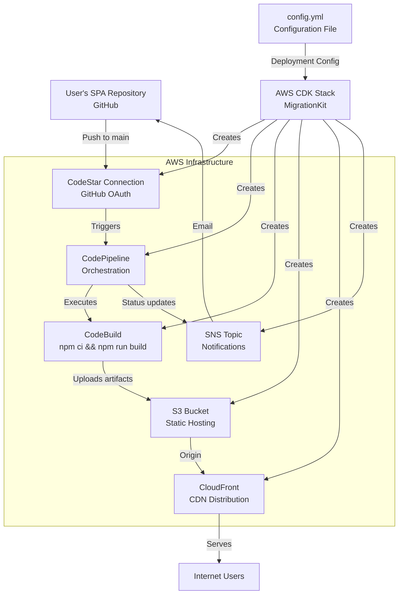
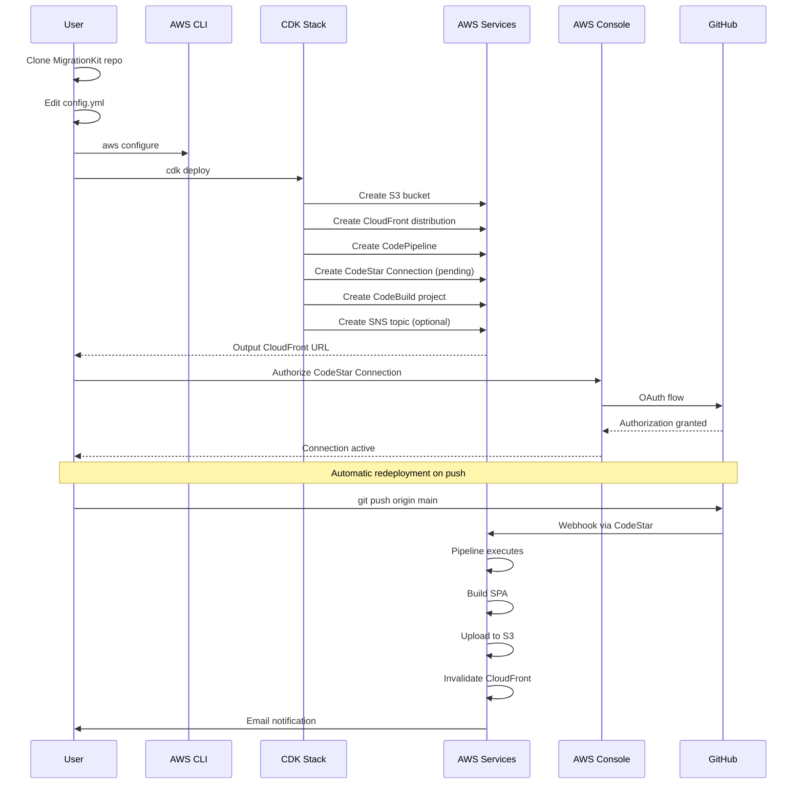
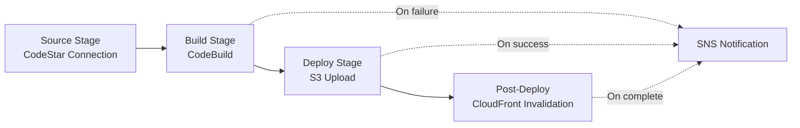

# Design Document: AWS SPA Migration Kit

## Overview

The AWS SPA Migration Kit is an infrastructure-as-code solution built with AWS CDK that enables users to deploy their existing Single Page Applications to AWS with minimal configuration. The kit creates a complete CI/CD pipeline that automatically rebuilds and redeploys the SPA whenever changes are pushed to the source repository on GitHub.

The design emphasizes simplicity and separation of concerns: the infrastructure repository remains completely separate from the user's SPA repository, requiring no modifications to the user's existing codebase or workflows. The kit provides a working implementation of core AWS services (S3, CloudFront, CodePipeline, CodeBuild, CodeStar Connections) with commented scaffolding for advanced features.

## Architecture

### High-Level Architecture



### Deployment Flow



### CI/CD Pipeline Stages



## Components and Interfaces

### 1. Configuration Module

**Purpose:** Parse and validate user configuration from config file.

**Interface:**
```typescript
interface MigrationConfig {
  github: {
    repositoryUrl: string;      // Full GitHub repo URL
    branch?: string;             // Default: "main"
  };
  aws: {
    region: string;              // AWS region for deployment
    accountId?: string;          // Optional, can be inferred
  };
  domain?: {
    customDomain?: string;       // Optional custom domain
    certificateArn?: string;     // Required if customDomain set
  };
  notifications?: {
    email?: string;              // Optional notification email
  };
  build?: {
    outputDirectory?: string;    // Default: "dist"
    buildCommand?: string;       // Default: "npm run build"
    installCommand?: string;     // Default: "npm ci"
  };
}

class ConfigLoader {
  static load(filePath: string): MigrationConfig;
  static validate(config: MigrationConfig): ValidationResult;
}

interface ValidationResult {
  valid: boolean;
  errors: string[];
  warnings: string[];
}
```

**Validation Rules:**
- GitHub repository URL must be valid HTTPS URL matching pattern: `https://github.com/{owner}/{repo}`
- AWS region must be a valid AWS region code
- If customDomain is set, certificateArn must be provided
- Email must match valid email format if provided
- Build commands must not contain shell injection characters

### 2. CDK Stack Module

**Purpose:** Define AWS infrastructure using CDK constructs.

**Interface:**
```typescript
class SpaM migrationStack extends cdk.Stack {
  constructor(scope: Construct, id: string, config: MigrationConfig);
  
  private createS3Bucket(): s3.Bucket;
  private createCloudFrontDistribution(bucket: s3.Bucket): cloudfront.Distribution;
  private createCodeStarConnection(): codeconnections.CfnConnection;
  private createCodeBuildProject(): codebuild.Project;
  private createPipeline(
    connection: codeconnections.CfnConnection,
    buildProject: codebuild.Project,
    bucket: s3.Bucket
  ): codepipeline.Pipeline;
  private createNotificationTopic(): sns.Topic | undefined;
  private setupCloudFrontInvalidation(
    distribution: cloudfront.Distribution,
    pipeline: codepipeline.Pipeline
  ): void;
}
```

**Key CDK Constructs:**
- `s3.Bucket` with public read access and website hosting enabled
- `cloudfront.Distribution` with S3 origin and default caching behavior
- `codeconnections.CfnConnection` for GitHub integration
- `codebuild.Project` with Node.js runtime and buildspec
- `codepipeline.Pipeline` with Source, Build, and Deploy stages
- `sns.Topic` with email subscription (conditional)

### 3. Pipeline Configuration Module

**Purpose:** Generate CodeBuild buildspec and pipeline stage definitions.

**Interface:**
```typescript
interface BuildSpec {
  version: string;
  phases: {
    install: { commands: string[] };
    build: { commands: string[] };
  };
  artifacts: {
    files: string[];
    baseDirectory: string;
  };
}

class PipelineConfigGenerator {
  static generateBuildSpec(config: MigrationConfig): BuildSpec;
  static createSourceStage(connection: codeconnections.CfnConnection): codepipeline.StageProps;
  static createBuildStage(project: codebuild.Project): codepipeline.StageProps;
  static createDeployStage(bucket: s3.Bucket): codepipeline.StageProps;
}
```

**Default BuildSpec:**
```yaml
version: 0.2
phases:
  install:
    commands:
      - npm ci
  build:
    commands:
      - npm run build
artifacts:
  files:
    - '**/*'
  base-directory: dist
```

### 4. Notification Module

**Purpose:** Configure SNS topic and subscriptions for deployment events.

**Interface:**
```typescript
class NotificationManager {
  constructor(
    scope: Construct,
    topic: sns.Topic,
    email: string
  );
  
  attachToPipeline(pipeline: codepipeline.Pipeline): void;
  attachToDistribution(distribution: cloudfront.Distribution): void;
  createSubscription(): sns.Subscription;
}

enum NotificationEvent {
  STACK_DEPLOYED = "Stack deployment complete",
  PIPELINE_SUCCESS = "Pipeline execution succeeded",
  PIPELINE_FAILURE = "Pipeline execution failed",
  CACHE_INVALIDATED = "CloudFront cache invalidated"
}
```

### 5. Advanced Features Module (Scaffolding)

**Purpose:** Provide commented examples for advanced configurations.

**Interface:**
```typescript
// Commented/disabled by default
class AdvancedFeatures {
  // API Gateway integration
  static createApiGateway(config: MigrationConfig): apigateway.RestApi;
  
  // Route 53 DNS configuration
  static createHostedZone(domainName: string): route53.HostedZone;
  static createAliasRecord(
    zone: route53.HostedZone,
    distribution: cloudfront.Distribution
  ): route53.ARecord;
  
  // ACM certificate management
  static createCertificate(domainName: string): acm.Certificate;
  
  // Multi-environment configuration
  static loadEnvironmentConfig(env: string): EnvironmentConfig;
}

interface EnvironmentConfig {
  name: string;  // dev, staging, prod
  config: MigrationConfig;
}
```

### 6. CLI Module

**Purpose:** Provide command-line interface for deployment operations.

**Interface:**
```typescript
class MigrationCLI {
  static deploy(configPath: string): Promise<DeploymentResult>;
  static destroy(configPath: string): Promise<void>;
  static validate(configPath: string): ValidationResult;
  static status(stackName: string): Promise<StackStatus>;
}

interface DeploymentResult {
  success: boolean;
  cloudFrontUrl: string;
  stackOutputs: Record<string, string>;
  errors?: string[];
}

interface StackStatus {
  stackName: string;
  status: string;
  lastUpdated: Date;
  outputs: Record<string, string>;
}
```

## Data Models

### Configuration File Schema

**File:** `config.yml`

```yaml
# Required: GitHub repository configuration
github:
  repositoryUrl: "https://github.com/username/my-spa"
  branch: "main"  # Optional, defaults to "main"

# Required: AWS configuration
aws:
  region: "us-east-1"  # Note: Some features require us-east-1
  # accountId: "123456789012"  # Optional, will be inferred if not provided

# Optional: Custom domain configuration
# domain:
#   customDomain: "www.example.com"
#   certificateArn: "arn:aws:acm:us-east-1:123456789012:certificate/abc123"

# Optional: Notification configuration
notifications:
  email: "user@example.com"  # Remove this line to disable notifications

# Optional: Build configuration (uses defaults if not specified)
# build:
#   outputDirectory: "dist"
#   buildCommand: "npm run build"
#   installCommand: "npm ci"

# Future: Multi-environment configuration (scaffolding only)
# environments:
#   dev:
#     aws:
#       region: "us-east-1"
#   staging:
#     aws:
#       region: "us-west-2"
#   prod:
#     aws:
#       region: "us-east-1"
#     domain:
#       customDomain: "www.example.com"
```

### CDK Stack Outputs

```typescript
interface StackOutputs {
  CloudFrontUrl: string;           // Distribution domain name
  S3BucketName: string;            // Bucket name for static files
  PipelineName: string;            // CodePipeline name
  CodeStarConnectionArn: string;   // Connection ARN for authorization
  NotificationTopicArn?: string;   // SNS topic ARN (if enabled)
}
```

### Pipeline Execution State

```typescript
interface PipelineExecution {
  executionId: string;
  status: "InProgress" | "Succeeded" | "Failed" | "Stopped";
  startTime: Date;
  endTime?: Date;
  stages: StageExecution[];
}

interface StageExecution {
  stageName: string;
  status: string;
  actions: ActionExecution[];
}

interface ActionExecution {
  actionName: string;
  status: string;
  errorMessage?: string;
}
```

## Correctness Properties


*A property is a characteristic or behavior that should hold true across all valid executions of a system—essentially, a formal statement about what the system should do. Properties serve as the bridge between human-readable specifications and machine-verifiable correctness guarantees.*

### Property 1: Configuration Validation Accepts Valid Configs

*For any* configuration object that contains all required fields (github.repositoryUrl, aws.region) with valid values, the validation function should return success with no errors.

**Validates: Requirements 1.1, 1.2, 1.7**

### Property 2: Configuration Validation Rejects Invalid Configs with Descriptive Errors

*For any* configuration object that is missing required fields or contains invalid values (malformed GitHub URL, invalid AWS region, invalid email format), the validation function should return failure with a descriptive error message identifying the specific problem.

**Validates: Requirements 1.7, 10.1, 10.2, 10.3, 10.6**

### Property 3: Optional Configuration Fields Are Handled Correctly

*For any* configuration object, optional fields (customDomain, notificationEmail, build settings) should be accepted when present with valid values, and default values should be used when they are absent.

**Validates: Requirements 1.3, 1.4, 1.5, 2.6**

### Property 4: BuildSpec Generation Contains Required Commands

*For any* valid configuration object, the generated buildspec should contain the install command (npm ci or custom), the build command (npm run build or custom), and the correct artifacts configuration with the specified output directory.

**Validates: Requirements 4.1, 4.2, 4.3, 9.5, 9.6**

### Property 5: Notification System Wiring

*For any* configuration with a notification email specified, the CDK stack should create an SNS topic with an email subscription and attach it to pipeline success events, pipeline failure events, and CloudFront invalidation events.

**Validates: Requirements 5.1, 5.2, 5.3, 5.4**

### Property 6: Deployment Output Contains Required Information

*For any* successful stack deployment, the output should contain the CloudFront distribution URL, S3 bucket name, pipeline name, and CodeStar connection ARN.

**Validates: Requirements 2.7**

### Property 7: Pipeline Configuration Uses Config File Repository URL

*For any* valid configuration object, the CodeStar connection source stage should be configured to monitor the GitHub repository URL specified in the config file.

**Validates: Requirements 6.3**

### Property 8: Pipeline Failure Triggers Notification

*For any* pipeline configuration with notifications enabled, when a build stage fails, the pipeline should halt execution and trigger a failure notification to the SNS topic.

**Validates: Requirements 4.6**

### Property 9: CloudFront Invalidation After Deployment

*For any* pipeline configuration, after the deploy stage successfully uploads artifacts to S3, a CloudFront cache invalidation should be triggered for the distribution.

**Validates: Requirements 4.5**

### Property 10: AWS Credentials Validation Provides Helpful Error

*For any* deployment attempt when AWS CLI credentials are not configured or are invalid, the system should fail early with a clear error message that includes instructions for running `aws configure`.

**Validates: Requirements 10.4**

## Error Handling

### Configuration Errors

**Invalid GitHub URL:**
- Pattern validation: Must match `https://github.com/{owner}/{repo}`
- Error message: "Invalid GitHub repository URL. Expected format: https://github.com/owner/repo"
- Fail fast: Validation occurs before any AWS resources are created

**Invalid AWS Region:**
- Validation against known AWS region list
- Additional check: Verify region supports CodePipeline, CodeBuild, CodeStar Connections
- Error message: "Invalid AWS region '{region}'. Must be a valid AWS region that supports CodePipeline, CodeBuild, and CodeStar Connections."
- Special note: Warn if region is not us-east-1 and custom domain is configured (ACM certificates for CloudFront require us-east-1)

**Missing Required Fields:**
- Error message: "Configuration validation failed: Missing required field '{fieldName}'"
- List all missing fields in a single error message
- Provide example configuration snippet

**Invalid Email Format:**
- Pattern validation: Standard email regex
- Error message: "Invalid notification email format: '{email}'"
- Suggestion: "Remove the notifications.email field to disable notifications"

### AWS Deployment Errors

**AWS Credentials Not Configured:**
- Detection: Catch AWS SDK credential errors
- Error message: "AWS credentials not found. Please configure AWS CLI:\n  aws configure\nOr set environment variables: AWS_ACCESS_KEY_ID, AWS_SECRET_ACCESS_KEY"
- Exit code: 1

**Insufficient IAM Permissions:**
- Detection: Catch AccessDenied errors during CDK deployment
- Error message: "Insufficient IAM permissions. The AWS user/role needs permissions for: S3, CloudFront, CodePipeline, CodeBuild, CodeStar Connections, SNS, IAM (for role creation)"
- Suggestion: Link to documentation with required IAM policy

**Stack Already Exists:**
- Detection: CDK stack already exists error
- Error message: "Stack '{stackName}' already exists. Use 'cdk deploy' to update or 'cdk destroy' to remove it first."
- Provide stack status and last update time

**Resource Limit Exceeded:**
- Detection: AWS service quota errors
- Error message: "AWS service limit exceeded: {limitType}. Request a limit increase in the AWS Service Quotas console."
- Include link to Service Quotas console

### Build Errors

**Build Failure:**
- CodeBuild captures all build logs
- Pipeline halts at Build stage
- SNS notification sent with failure details
- Error accessible in: AWS Console → CodePipeline → Execution details → Build stage logs
- Common causes documented: Missing dependencies, incorrect build command, Node.js version mismatch

**Artifact Upload Failure:**
- Detection: S3 upload errors in Deploy stage
- Pipeline halts at Deploy stage
- SNS notification sent
- Possible causes: S3 bucket permissions, artifact size exceeds limits

**CloudFront Invalidation Failure:**
- Detection: CloudFront API errors
- Does not halt pipeline (deployment still succeeds)
- Warning logged and notification sent
- Suggestion: Manual invalidation via AWS Console or wait for TTL expiration

### GitHub Integration Errors

**CodeStar Connection Not Authorized:**
- Detection: Connection status is "PENDING"
- Error message: "CodeStar Connection requires authorization. Please visit the AWS Console:\n  {consoleUrl}\nAnd click 'Update pending connection' to authorize GitHub access."
- Pipeline will not trigger until authorized

**Repository Not Accessible:**
- Detection: Source stage fails with access denied
- Error message: "Cannot access GitHub repository. Verify:\n  1. Repository URL is correct\n  2. CodeStar Connection is authorized\n  3. Repository is not private (or GitHub App has access to private repos)"

**Branch Not Found:**
- Detection: Source stage fails with branch not found
- Error message: "Branch '{branch}' not found in repository. Verify the branch name in config.yml"

## Testing Strategy

### Unit Testing

Unit tests will focus on specific components and edge cases:

**Configuration Module:**
- Test valid configuration parsing
- Test each validation rule individually
- Test default value assignment
- Test error message formatting
- Edge cases: Empty strings, null values, special characters in URLs

**BuildSpec Generation:**
- Test default buildspec generation
- Test custom build commands
- Test custom output directories
- Test artifact configuration
- Edge cases: Empty build commands, paths with special characters

**CDK Stack Construction:**
- Test stack synthesizes without errors
- Test conditional resource creation (SNS topic when email configured)
- Test resource naming conventions
- Test IAM role policies are correctly scoped
- Edge cases: Missing optional configuration, minimal configuration

**Notification Module:**
- Test SNS topic creation
- Test email subscription creation
- Test event rule attachment
- Edge cases: Invalid email format handling, missing email

**CLI Module:**
- Test command parsing
- Test error message formatting
- Test AWS credential detection
- Edge cases: Missing config file, malformed YAML

### Property-Based Testing

Property tests will verify universal correctness across all inputs. Each test should run a minimum of 100 iterations.

**Configuration:**
- Use a property-based testing library appropriate for the implementation language:
  - TypeScript: fast-check
  - Python: Hypothesis
  - Other languages: Equivalent PBT library

**Test Tagging:**
- Each property test must include a comment tag referencing the design property
- Format: `// Feature: aws-spa-migration-kit, Property {N}: {property description}`

**Property Test Implementations:**

1. **Property 1 Test: Valid Config Acceptance**
   - Generate random valid configurations (all required fields present, valid formats)
   - Assert validation returns success
   - Tag: `Feature: aws-spa-migration-kit, Property 1: Configuration Validation Accepts Valid Configs`

2. **Property 2 Test: Invalid Config Rejection**
   - Generate random invalid configurations (missing fields, invalid formats)
   - Assert validation returns failure with non-empty error message
   - Assert error message contains relevant field name
   - Tag: `Feature: aws-spa-migration-kit, Property 2: Configuration Validation Rejects Invalid Configs with Descriptive Errors`

3. **Property 3 Test: Optional Field Handling**
   - Generate random configurations with various combinations of optional fields
   - Assert validation succeeds for all combinations
   - Assert defaults are applied when optional fields are missing
   - Tag: `Feature: aws-spa-migration-kit, Property 3: Optional Configuration Fields Are Handled Correctly`

4. **Property 4 Test: BuildSpec Command Inclusion**
   - Generate random valid configurations with various build settings
   - Assert generated buildspec contains install command
   - Assert generated buildspec contains build command
   - Assert generated buildspec has correct output directory
   - Tag: `Feature: aws-spa-migration-kit, Property 4: BuildSpec Generation Contains Required Commands`

5. **Property 5 Test: Notification Wiring**
   - Generate random configurations with notification email
   - Assert SNS topic is created in stack
   - Assert email subscription is created
   - Assert pipeline has notification rules attached
   - Tag: `Feature: aws-spa-migration-kit, Property 5: Notification System Wiring`

6. **Property 6 Test: Deployment Output Completeness**
   - Generate random valid configurations
   - Synthesize CDK stack
   - Assert stack outputs contain CloudFrontUrl
   - Assert stack outputs contain S3BucketName
   - Assert stack outputs contain PipelineName
   - Assert stack outputs contain CodeStarConnectionArn
   - Tag: `Feature: aws-spa-migration-kit, Property 6: Deployment Output Contains Required Information`

7. **Property 7 Test: Repository URL Configuration**
   - Generate random valid GitHub URLs
   - Assert CodeStar connection source uses the configured URL
   - Tag: `Feature: aws-spa-migration-kit, Property 7: Pipeline Configuration Uses Config File Repository URL`

8. **Property 8 Test: Pipeline Failure Notification**
   - Generate random configurations with notifications enabled
   - Assert pipeline has failure notification rule
   - Assert notification targets the SNS topic
   - Tag: `Feature: aws-spa-migration-kit, Property 8: Pipeline Failure Triggers Notification`

9. **Property 9 Test: CloudFront Invalidation Configuration**
   - Generate random valid configurations
   - Assert pipeline includes post-deploy invalidation action
   - Assert invalidation targets the CloudFront distribution
   - Tag: `Feature: aws-spa-migration-kit, Property 9: CloudFront Invalidation After Deployment`

10. **Property 10 Test: AWS Credentials Error Message**
    - Mock AWS credential failure
    - Assert error message contains "aws configure"
    - Assert error message is helpful and actionable
    - Tag: `Feature: aws-spa-migration-kit, Property 10: AWS Credentials Validation Provides Helpful Error`

### Integration Testing

Integration tests will verify the complete workflow with actual AWS resources (run in a test AWS account):

**End-to-End Deployment Test:**
1. Create test configuration pointing to sample SPA repository
2. Run `cdk deploy`
3. Verify all AWS resources are created
4. Authorize CodeStar Connection
5. Trigger pipeline by pushing to sample SPA repository
6. Verify pipeline executes successfully
7. Verify SPA is accessible via CloudFront URL
8. Verify notification email is received (if configured)
9. Clean up: Run `cdk destroy`

**Multi-Configuration Test:**
- Test with minimal configuration (only required fields)
- Test with full configuration (all optional fields)
- Test with custom build commands
- Test with notification email
- Test without notification email

### Manual Testing Checklist

**Pre-Release Verification:**
- [ ] Clone fresh repository
- [ ] Follow README quick start guide exactly as written
- [ ] Verify all prerequisites are clearly documented
- [ ] Deploy to test AWS account
- [ ] Authorize CodeStar Connection
- [ ] Push change to sample SPA repository
- [ ] Verify automatic redeployment works
- [ ] Verify CloudFront serves updated content
- [ ] Verify notification emails are received
- [ ] Test `cdk destroy` cleanup
- [ ] Verify no orphaned AWS resources remain

**Documentation Verification:**
- [ ] All commands in README are correct
- [ ] Architecture diagrams match actual implementation
- [ ] Troubleshooting section covers common errors
- [ ] Advanced features scaffolding is clearly marked as non-functional
- [ ] Links to AWS documentation are valid

**Cross-Platform Testing:**
- [ ] Test on macOS
- [ ] Test on Linux
- [ ] Test on Windows (WSL)
- [ ] Verify AWS CLI works on all platforms
- [ ] Verify Node.js/npm commands work on all platforms
