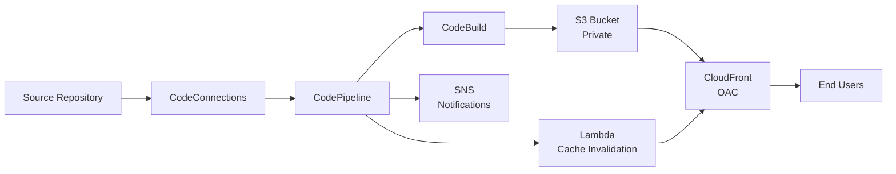

# AWS SPA Hosting Kit

**Copyright © 2026 Rusty Nations. Released under MIT License.**

Infrastructure-as-code solution for hosting Single Page Applications on AWS with automated CI/CD pipelines.

## Design Tenets

- **Infrastructure-only**: Application code is never modified
- **AWS-native primitives**: No additional control planes or frameworks
- **Secure by default**: Private S3, Origin Access Control, least privilege IAM
- **Configuration-driven**: Not framework-driven
- **Easy to start, easy to extend, safe to abandon**

## Overview

The AWS SPA Hosting Kit provides a complete infrastructure setup for hosting your SPA on AWS with:

- **S3 + CloudFront**: Static hosting with global CDN delivery
- **Automated CI/CD**: CodePipeline triggered by GitHub commits
- **Zero SPA Changes**: Your existing SPA repository remains untouched
- **Email Notifications**: Optional deployment status alerts
- **One Command Deploy**: Simple setup and deployment

Each deployment is identified by a `projectName`, allowing multiple SPAs to be hosted safely in the same AWS account.

This kit can be used both to host a new SPA from scratch and to migrate an existing SPA to AWS. The design intentionally keeps infrastructure and application code separate, allowing teams to adopt AWS-native hosting and CI/CD without modifying their existing repositories or workflows.

This kit is designed for teams that want AWS-native hosting and CI/CD without adopting a new frontend framework, service control plane, or modifying their existing SPA repository.

## How It Works

### Step 1: Configuration & Validation

The kit loads your configuration from `config/config.yml` and validates all required fields:
- GitHub repository URL and branch
- AWS region and account settings
- Optional notification email
- Optional build commands and output directory

The `ConfigLoader` class handles YAML parsing, applies sensible defaults, and validates configuration against AWS service requirements.

### Step 2: Infrastructure Deployment

When you run `npm run deploy`, AWS CDK synthesizes and deploys CloudFormation templates that create:

1. **S3 Bucket**: Private bucket with encryption enabled and all public access blocked
2. **CloudFront Distribution**: CDN with Origin Access Control (OAC) for secure S3 access
3. **CodeStar Connection**: GitHub OAuth integration for repository access
4. **CodeBuild Project**: Build environment with Node.js 20 runtime
5. **CodePipeline**: Three-stage pipeline (Source → Build → Deploy)
6. **SNS Topic**: Optional notification system for deployment events
7. **Lambda Functions**: CloudFront cache invalidation trigger

### Step 3: Source Repository Authorization

After initial deployment, you authorize the connection in the AWS Console:
- Navigate to Developer Tools → Settings → Connections
- Find your connection (named `{projectName}-github`)
- Complete OAuth authorization with your source code provider

**Supported Providers**: GitHub, Bitbucket, GitLab, GitHub Enterprise Server, GitLab self-managed, and Azure DevOps

### Step 4: Automated Deployments

Once authorized, the pipeline automatically triggers on every push to your configured branch:

1. **Source Stage**: GitHub connection detects push and fetches source code
2. **Build Stage**: CodeBuild runs `npm ci` and `npm run build` to create production assets
3. **Deploy Stage**: Built artifacts are uploaded to S3 bucket
4. **Post-Deploy**: Lambda function invalidates CloudFront cache for immediate updates

### Step 5: Notifications

If configured, SNS sends email notifications for:
- Stack deployment completion
- Pipeline execution success
- Pipeline execution failure
- CloudFront cache invalidation

## Architecture

### High-Level Flow



**Security**: S3 bucket is private with CloudFront Origin Access Control (OAC) for secure access.

**SPA Routing**: CloudFront error response mapping (404/403 → index.html) ensures client-side routing works correctly.

## Core Components

| Component | Purpose | Implementation |
|-----------|---------|----------------|
| ConfigLoader | Configuration parsing and validation | [src/config/loader.ts](src/config/loader.ts) |
| SpaHostingStack | Main CDK stack orchestration | [src/stack/spa-hosting-stack.ts](src/stack/spa-hosting-stack.ts) |
| PipelineConfigGenerator | BuildSpec generation for CodeBuild | [src/pipeline/buildspec-generator.ts](src/pipeline/buildspec-generator.ts) |
| NotificationManager | SNS topic and subscription management | [src/notifications/notification-manager.ts](src/notifications/notification-manager.ts) |

## AWS Services Integration

- **Amazon S3**: Private bucket for static asset storage with server-side encryption
- **Amazon CloudFront**: Global CDN with Origin Access Control (OAC) for secure S3 access and HTTPS enforcement
- **AWS CodePipeline**: Three-stage CI/CD orchestration (Source → Build → Deploy)
- **AWS CodeBuild**: Serverless build environment with Node.js 20 runtime
- **AWS CodeConnections**: Source repository integration via OAuth (supports GitHub, Bitbucket, GitLab, GitHub Enterprise Server, GitLab self-managed, and Azure DevOps)
- **Amazon SNS**: Email notification system for deployment events
- **AWS Lambda**: CloudFront cache invalidation trigger on successful deployments
- **Amazon EventBridge**: Event-driven automation for pipeline state changes
- **AWS IAM**: Fine-grained permissions for service-to-service communication

## Technical Implementation

### Configuration-Driven Architecture

The kit uses a declarative YAML configuration file that drives all infrastructure decisions. The `ConfigLoader` validates configuration at deployment time, preventing invalid deployments before any AWS resources are created.

### Origin Access Control (OAC)

Modern AWS-recommended approach for CloudFront-to-S3 security. The kit creates an OAC resource and configures S3 bucket policies to allow only CloudFront access using AWS:SourceArn conditions. This replaces the legacy Origin Access Identity (OAI) approach.

### Buildspec Generation

The `PipelineConfigGenerator` dynamically creates CodeBuild buildspec configurations based on your SPA's requirements. Supports custom install commands, build commands, and output directories while providing sensible defaults.

### Event-Driven Notifications

EventBridge rules monitor CodePipeline state changes and trigger SNS notifications. Lambda functions handle CloudFront cache invalidation and send completion notifications.

### Infrastructure as Code

Built with AWS CDK (TypeScript), providing type safety, IDE autocomplete, and the full power of CloudFormation. All infrastructure is version-controlled and reproducible.

## Prerequisites

See [PREREQUISITES.md](PREREQUISITES.md) for a complete checklist of required tools, permissions, and accounts.

## Quick Start

Prefer guided setup? Use the AI-assisted setup prompt in [IDEPrompt.md](IDEPrompt.md).

### 1. Clone this repository

```bash
git clone https://github.com/rusty428/aws-spa-hosting-kit.git
cd aws-spa-hosting-kit
```

### 2. Install dependencies

```bash
npm install
```

### 3. Configure your SPA

Copy the example configuration and edit it:

```bash
cp config/config.example.yml config/config.yml
```

Edit `config/config.yml` with your settings:

```yaml
projectName: "my-spa-project"

github:
  repositoryUrl: "https://github.com/your-username/your-spa-repo"
  branch: "main"

aws:
  region: "us-east-1"

notifications:
  email: "your-email@example.com"
```

### 4. Deploy the infrastructure

```bash
npm run deploy
```

CDK will display a summary of IAM permissions and security changes, then prompt for confirmation:

```
Do you wish to deploy these changes (y/n)?
```

This is a CDK safety feature that requires approval when creating IAM roles and policies. Review the changes and type `y` to proceed.

The deployment will:
- Create private S3 bucket for static assets
- Create CloudFront distribution
- Set up CodePipeline with GitHub integration
- Configure email notifications (if enabled)

**Expected time**: 5-10 minutes for initial deployment

### 5. Authorize Source Repository Connection

After deployment, you'll see output with a Connection ARN. You need to authorize this connection:

**Note**: CDK deployment completes successfully even with an unauthorized connection. The pipeline won't work until you complete this authorization step, but there's no time pressure - you can do it immediately or later.

1. Go to AWS Console → Developer Tools → Settings → Connections
   - Direct link: `https://console.aws.amazon.com/codesuite/settings/connections?region=YOUR-REGION`
   - Replace `YOUR-REGION` with your deployment region (e.g., `us-east-1`)
2. Find the connection (named after your `projectName`, e.g., "my-spa-project-github")
3. Click "Update pending connection"
4. Complete the OAuth authorization with your source code provider

**Note**: This kit is configured for GitHub by default, but AWS CodeConnections supports other providers including Bitbucket, GitLab, GitHub Enterprise Server, GitLab self-managed, and Azure DevOps. To use a different provider, modify the connection configuration in the CDK stack.

### 6. Done!

Your infrastructure is ready! Any push to the configured branch will automatically trigger a redeployment.

The CloudFront URL will be in the deployment output:
```
Outputs:
SpaHostingStack.CloudFrontUrl = https://d1234567890.cloudfront.net
```

## Configuration Options

### Required Fields

```yaml
projectName: "my-spa-project"  # Unique identifier (namespace) for all AWS resources
                                # Changing this creates NEW infrastructure

github:
  repositoryUrl: "https://github.com/owner/repo"  # Your SPA repository
  
aws:
  region: "us-east-1"  # AWS region for deployment
```

### Optional Fields

```yaml
github:
  branch: "main"  # Branch to monitor (default: "main")

notifications:
  email: "you@example.com"  # Deployment notifications

build:
  outputDirectory: "dist"  # Build output folder (default: "dist")
  buildCommand: "npm run build"  # Build command (default: "npm run build")
  installCommand: "npm ci"  # Install command (default: "npm ci")

tags:  # Resource tags for cost allocation and organization
  Environment: "production"
  Team: "frontend"
  CostCenter: "engineering"
  Owner: "team@example.com"
```

**Note on Tags**: All resources created by this kit will be tagged with:
- Default tags: `ProjectName` (your projectName) and `ManagedBy: aws-spa-hosting-kit`
- Custom tags: Any tags you define in the `tags` section

Tags are useful for:
- Cost allocation and tracking in AWS Cost Explorer
- Resource organization across multiple projects/teams
- Compliance and governance requirements

## Supported SPA Frameworks

This kit works with any SPA framework that builds to static files:

- ✅ React (Create React App, Vite, Next.js static export)
- ✅ Vue (Vue CLI, Vite)
- ✅ Angular
- ✅ Svelte
- ✅ Any framework that outputs HTML/CSS/JS

**Constraint:** Frameworks must produce a fully static output directory (e.g., `dist/`, `build/`). Server-side rendering is out of scope.

## Non-Goals

This kit does not:

- Modify your SPA repository or Git workflows
- Manage backend services, authentication, or APIs
- Replace your existing CI for non-frontend workloads
- Provide preview environments or PR-based deployments (yet)

Many teams start with this kit as a lift-and-shift hosting migration, then progressively enable custom domains, WAF, logging, or multi-environment deployments as their AWS footprint grows. It's equally suitable for greenfield SPAs that need production-grade AWS hosting from day one.

## Notifications

When notifications are enabled, you'll receive emails for:

- ✅ Stack deployment complete
- ✅ Pipeline execution succeeded
- ❌ Pipeline execution failed
- 🔄 CloudFront cache invalidated

## Commands

```bash
# Build TypeScript
npm run build

# Deploy infrastructure
npm run deploy

# Deploy with specific AWS profile
npm run deploy -- --profile YOUR-PROFILE-NAME

# Skip confirmation prompt (for CI/CD)
npm run deploy -- --require-approval never

# Destroy infrastructure
npm run destroy

# Destroy with specific AWS profile
npm run destroy -- --profile YOUR-PROFILE-NAME

# Synthesize CloudFormation template
npx cdk synth

# Synthesize with specific AWS profile
npx cdk synth --profile YOUR-PROFILE-NAME

# View differences
npm run cdk diff

# View differences with specific AWS profile
npm run cdk diff -- --profile YOUR-PROFILE-NAME
```

**Note**: The `--` before `--profile` is required to pass arguments through npm to the underlying CDK command.

## Infrastructure

For detailed information about the CDK infrastructure, deployment process, and development workflow, see [DEVELOPER.md](DEVELOPER.md).

## Troubleshooting

### CDK CLI version mismatch

**Error**: `This CDK CLI is not compatible with the CDK library used by your application`

**Solution**: The project uses `npx cdk` to ensure the correct CDK version. All npm scripts (`npm run deploy`, `npm run destroy`) already use the local CDK CLI. If you're running `cdk` commands directly, use `npx cdk` instead or upgrade your global CDK CLI:

```bash
npm install -g aws-cdk@latest
```

### Using AWS profiles

If you have multiple AWS profiles configured, pass the `--profile` flag:

```bash
# Deploy with specific profile
npm run deploy -- --profile YOUR-PROFILE-NAME

# Synthesize with specific profile
npx cdk synth --profile YOUR-PROFILE-NAME
```

**Note**: The `--` before `--profile` is required to pass arguments through npm to the CDK command.

### SNS email notifications not received

**Problem**: Email notifications are not being delivered

**Solution**:

1. **Check your spam/junk folder** for an SNS subscription confirmation email from AWS
2. Click the confirmation link in the email to confirm your subscription
3. If you don't see the confirmation email:
   - Check that the email address in `config.yml` is correct
   - Request a new confirmation email from AWS Console → SNS → Subscriptions
   - Look for emails from `no-reply@sns.amazonaws.com`

**Note**: Email subscriptions require confirmation before notifications are delivered. This is a security feature to prevent spam.

**Alternative**: Remove the `email` field from `config.yml` to disable notifications entirely.

### Configuration validation failed

Make sure your `config.yml` has:
- Valid project name (alphanumeric, hyphens, underscores only)
- Valid GitHub repository URL (format: `https://github.com/owner/repo`)
- Valid AWS region

### CloudFront distribution timeout

**Error**: `Resource timed out waiting for completion` or `Exceeded attempts to wait` for CloudFront distribution

**Cause**: CloudFront distributions take 15-30 minutes to create. CDK may timeout before CloudFront finishes.

**Solution**:

1. Check the actual status in AWS Console → CloudFormation → SpaHostingStack
2. If stack shows `ROLLBACK_FAILED`:
   - Select the stack in CloudFormation console
   - Click "Delete" (this takes 20-30 minutes as CloudFront deletes)
   - Once deleted, run `npm run deploy` again
3. If CloudFront is still creating, wait for it to complete before retrying

**Note**: CloudFront creation cannot be accelerated. Ensure stable network connection during deployment.

### Outdated CDK bootstrap stack

**Warning**: `Bootstrap stack outdated` or version < 21

**Solution**: Update the CDK bootstrap stack:

```bash
npx cdk bootstrap aws://ACCOUNT-ID/REGION --profile YOUR-PROFILE-NAME
```

Replace `ACCOUNT-ID` with your AWS account ID and `REGION` with your deployment region (e.g., `us-east-1`).
- Valid email format (if notifications enabled)

### Pipeline not triggering

1. Check that your source repository connection is authorized in AWS Console (Developer Tools → Settings → Connections)
   - Direct link: `https://console.aws.amazon.com/codesuite/settings/connections?region=YOUR-REGION`
2. Verify the branch name matches your configuration
3. Verify the repository URL format matches your provider (GitHub, Bitbucket, GitLab, etc.)
4. Check CodePipeline execution history in AWS Console

### Build failures

Check CodeBuild logs in AWS Console:
1. Go to CodePipeline
2. Click on your pipeline execution
3. Click "Details" on the Build stage
4. View logs for error messages

Common issues:
- Incorrect build command
- Wrong output directory
- Missing dependencies in package.json

## AWS Region Notes

- Most features work in any AWS region
- **ACM certificates for CloudFront** require `us-east-1`
- If using custom domains, consider deploying to `us-east-1`

## Advanced Features (Commented Scaffolding)

The kit includes commented examples for:

- API Gateway integration
- Route 53 DNS configuration
- ACM certificate management
- Multi-environment setups (dev/staging/prod)

See `config/config.example.yml` for details.

## Cost Estimate

Typical monthly costs for a small SPA:

- **S3**: $0.023/GB storage + $0.09/GB transfer
- **CloudFront**: $0.085/GB (first 10TB)
- **CodePipeline**: $1/active pipeline
- **CodeBuild**: $0.005/build minute

**Estimated**: $5-20/month for most SPAs

## Sample SPA

This kit is tested with: https://github.com/rusty428/aws-spa-react-example

A React + Vite + TypeScript SPA that demonstrates the complete workflow. This sample can be used as a starting point for new SPAs or as a reference for hosting an existing SPA.

## Why This Exists

**Why not Amplify?**
Amplify is a full-stack framework with its own CLI, conventions, and abstractions. This kit is for teams that want direct control over AWS primitives without framework lock-in.

**Why not Netlify/Vercel?**
Those are excellent platforms, but some teams need AWS-native infrastructure for compliance, existing AWS investments, or integration with other AWS services. This kit provides that without vendor lock-in.

**Why CDK + primitives?**
CDK gives you the full power of CloudFormation with type safety and composability. You can extend this kit with any AWS service, customize IAM policies, or integrate with existing infrastructure—all in TypeScript.

This kit is infrastructure, not a framework. You own the code, you control the deployment, and you can evolve it as your needs grow.

## Related Projects

- [Sample SPA Repository](https://github.com/rusty428/aws-spa-react-example) - React + Vite + TypeScript reference implementation

## AI-Assisted Setup

This kit includes an AI prompt template for guided setup. If you're using an AI-powered IDE or coding assistant:

1. Open [IDEPrompt.md](IDEPrompt.md)
2. Copy the prompt template
3. Fill in your project details (project name, repository URL, etc.)
4. Paste into your AI assistant (Cursor, GitHub Copilot Chat, Kiro, Windsurf, etc.)
5. Follow the AI's guidance through setup and deployment

The AI will help you:
- Clone and configure the repository
- Create a valid `config.yml` file
- Validate your configuration
- Build and deploy the infrastructure
- Understand post-deployment steps

**Note**: The AI follows this repository's documentation and does not replace reviewing README.md and PREREQUISITES.md.

## Support & Stability

This project is provided as infrastructure scaffolding.

- **Breaking changes** will be called out in release notes (see [CHANGELOG.md](CHANGELOG.md))
- **Configuration compatibility** will be preserved when possible
- **Issues and PRs** are welcome; support is best-effort
- **Versioning** follows [Semantic Versioning](https://semver.org/)

## IAM Permissions Summary

This kit requires permission to create and manage:

- **S3 buckets** (static assets storage)
- **CloudFront distributions** (CDN delivery)
- **CodePipeline and CodeBuild resources** (CI/CD automation)
- **CodeConnections** (source repository integration)
- **IAM roles** (service execution with least privilege)
- **SNS topics and subscriptions** (deployment notifications)
- **Lambda functions** (CloudFront cache invalidation)
- **EventBridge rules** (event-driven automation)

See [PREREQUISITES.md](PREREQUISITES.md) for detailed permission requirements.

## Safe Teardown

All resources created by this kit are namespaced under your `projectName`. Running `npm run destroy` removes only resources created for that specific project, making it safe to use in shared AWS accounts. Other projects and resources remain untouched.

### Cleanup Instructions

To completely remove all infrastructure:

```bash
npm run destroy
```

Or with a specific AWS profile:

```bash
npm run destroy -- --profile YOUR-PROFILE-NAME
```

This will delete:
- S3 bucket (and all contents)
- CloudFront distribution
- CodePipeline
- CodeBuild project
- CodeConnections connection
- SNS topic and subscriptions
- Lambda functions
- EventBridge rules
- IAM roles and policies

The deletion process takes 15-20 minutes due to CloudFront distribution removal.

## Known Limitations

- **No PR preview environments**: Pipeline triggers only on configured branch
- **No blue/green deployments**: Direct S3 replacement with cache invalidation
- **Static-only output**: Server-side rendering (SSR) is out of scope
- **Single-region deployment**: Multi-region replication not included
- **No built-in auth**: Authentication/authorization must be handled separately

These are intentional scope boundaries for v1. Future versions may address some of these.

## License

MIT

## Contact

For questions or custom configurations, contact @awsrusty

---

Last updated: 2026-02-10
